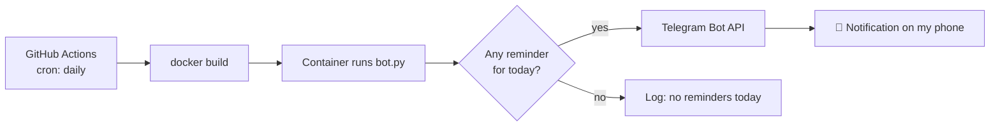

# 🔔 Reminder Bot

A small, Dockerized Telegram bot that sends me **monthly payment reminders** (rent, taxes, subscriptions) on the right day of the month.
It runs **automatically every day in the cloud with GitHub Actions**, so no personal computer or server needs to stay on.


---

## ✨ Features

- 📅 Reminders configured in a simple **JSON file**: no code changes needed to add one
- 📱 Push notifications to my phone through the **Telegram Bot API**
- 🐳 Runs inside a **Docker container** with the correct time zone (`Europe/Athens`)
- ☁️ **Scheduled daily with GitHub Actions** (cron), no server required
- 🔐 Secrets handled safely: `.env` locally, **GitHub Secrets** in CI, never committed to the repo
- 🧾 Timestamped logs and clear error messages from the Telegram API
- 🔁 Two run modes: **one-shot** (for CI) or a **long-running scheduler** (for a home server)

---

## 🏗️ How it works



1. Every morning GitHub Actions starts a fresh Ubuntu runner.
2. It builds the Docker image from the `Dockerfile` in this repo.
3. The container runs `bot.py` once (`RUN_ONCE=true`).
4. The bot reads `reminders.json`, checks today's day of the month, and sends the matching reminders through the Telegram API.

---

## 📁 Project structure

```
reminder-bot/
├── .github/
│   └── workflows/
│       └── daily.yml        # GitHub Actions workflow (daily schedule)
├── bot.py                   # The bot: reads reminders, sends messages
├── reminders.json           # List of reminders (day + message)
├── Dockerfile               # Container image definition
├── requirements.txt         # Python dependencies
├── .env.example             # Required environment variables (no real values)
├── .dockerignore            # Files kept out of the image (.env, .venv, .git)
└── .gitignore               # Files kept out of Git (.env, .venv)
```

---

## ⚙️ Configuration

### Reminders

Edit `reminders.json`. Each reminder has a `day` (1–31) and a `message`:

```json
[
  {"day": 1, "message": "Pay the accountant"},
  {"day": 5, "message": "Pay the rent"},
  {"day": 27, "message": "Pay Spotify"}
]
```

### Environment variables

| Variable | Required | Description |
|---|---|---|
| `TELEGRAM_TOKEN` | ✅ | Bot token from [@BotFather](https://t.me/BotFather) |
| `TELEGRAM_CHAT_ID` | ✅ | Your Telegram chat ID |
| `RUN_ONCE` | ❌ | `true` = run once and exit (CI). Default: `false` (scheduler) |
| `SEND_TIME` | ❌ | Daily time for scheduler mode, e.g. `09:00`. Default: `09:00` |

---

## 🚀 Getting started

### 1. Create a Telegram bot

1. Talk to [@BotFather](https://t.me/BotFather) and create a new bot to get a **token**.
2. Send any message to your new bot.
3. Open `https://api.telegram.org/bot<TOKEN>/getUpdates` and copy your **chat ID** from `"chat":{"id":...}`.

### 2. Run locally with Python

```bash
git clone https://github.com/Fivlles/reminder-bot.git
cd reminder-bot

python -m venv .venv
# Windows: .venv\Scripts\activate   |   Linux/macOS: source .venv/bin/activate
pip install -r requirements.txt

cp .env.example .env    # then fill in your token and chat ID
python bot.py
```

### 3. Run with Docker

```bash
docker build -t reminder-bot .

# One-shot run
docker run --rm --env-file .env -e RUN_ONCE=true reminder-bot

# Long-running scheduler (e.g. on a home server)
docker run -d --name reminder-bot --restart unless-stopped --env-file .env reminder-bot
docker logs -f reminder-bot
```

### 4. Run automatically with GitHub Actions

1. Fork or push this repo to GitHub.
2. Go to **Settings → Secrets and variables → Actions** and add:
   - `TELEGRAM_TOKEN`
   - `TELEGRAM_CHAT_ID`
3. The workflow in `.github/workflows/daily.yml` runs **every day at 06:00 UTC**.
4. To test it, open the **Actions** tab → **Daily reminders** → **Run workflow**.

> ℹ️ GitHub Actions cron schedules use **UTC**. 06:00 UTC is 09:00 in Greece in summer and 08:00 in winter. The reminder **date** is always correct because the container uses `TZ=Europe/Athens`.

---

## 🧠 What I learned

- Building and running **Docker images**: Dockerfile, layer caching, `.dockerignore`, environment variables
- Working with a **REST API** (Telegram Bot API) using HTTP requests
- Managing **secrets** properly: `.env`, `.gitignore`, GitHub Secrets
- **CI/CD scheduling** with GitHub Actions and cron expressions
- Handling **time zones** in containers
- Using Git day to day: commits, staging, pushing, and debugging what actually reached the remote

---

## 🗺️ Possible improvements

- [ ] Send a reminder a few days **before** the due date (`days_before`)
- [ ] Support weekly or yearly reminders
- [ ] Fail the workflow (and get an email from GitHub) when a message cannot be sent
- [ ] Bot commands, e.g. `/list` to see upcoming reminders

---

## 👤 Author

**Fivlles**: [GitHub](https://github.com/Fivlles) 
